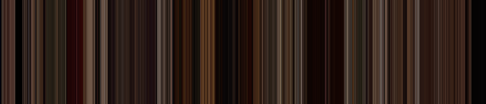
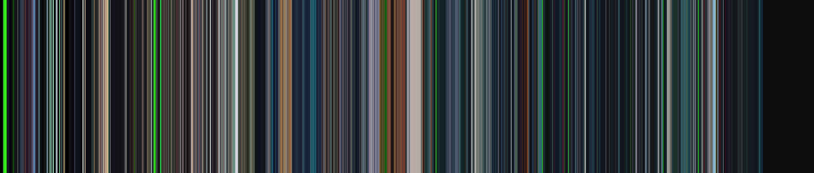
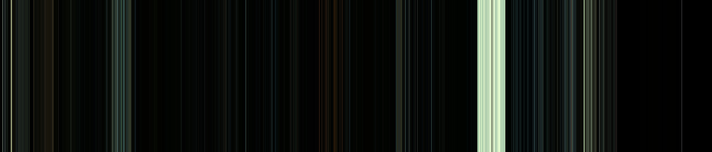
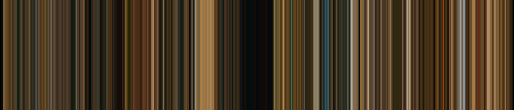

# FrameBars

Generate colour palettes of your favorite movies!




### Prerequisites

[openCV](https://opencv.org/) library.


### Installation

* Install openCV using [this](https://docs.opencv.org/master/d7/d9f/tutorial_linux_install.html) guide.
* Clone `FrameBars`.


### Compilation

Compile the program using:

```
main.cpp -o framebars `pkg-config --cflags --libs opencv` -std=c++11
```


### Usage

```
./framebars <path_to_video_file>
```

For example

```
./framebars '/media/username/DriveName/Movies/test.mp4'
```


### Output

Output will be a png image inside the folder where video is present.


### How does it work?

One frame is extracted from each second of the video. Kmeans clustering is used to extract the most dominant colour
in the frame. Each line in the image represents one second of video. These are then stiched together to create the final result.


### Examples


Pulp Fiction



Ghost in the Shell (1995)



Harry Potter and the Deathly Hallows - Part 2



The Darjeeling Limited


### To Do

* Batch mode.
* Post processing.
* Better error handling.
* Deploy the program.
* Windows compatibility.
* GUI.
* More examples.


## Acknowledgments

* Thanks to [Alan Zucconi](https://www.alanzucconi.com/2015/05/24/how-to-find-the-main-colours-in-an-image/) and [Dillon Baker](http://dillonbaker.com/#/spectrum/) for inspiration.
